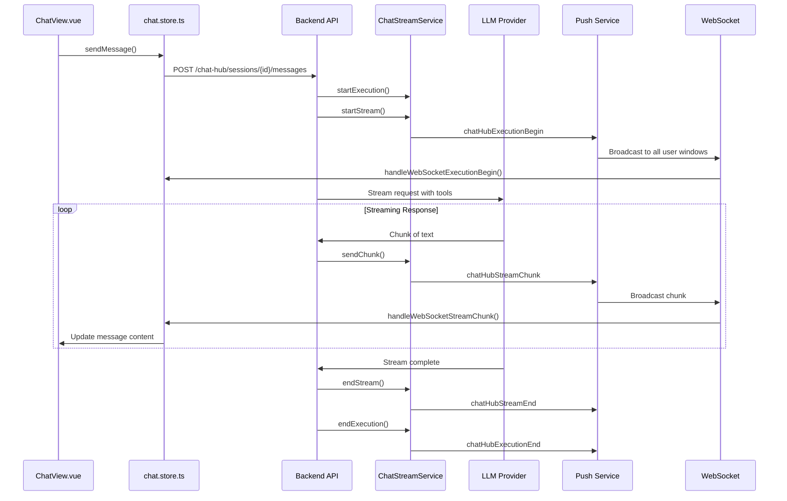

# n8n Chat Hub Deep Dive - Technical Analysis

**Date:** 2026-02-26  
**Purpose:** Complete technical analysis of n8n's Chat Hub module for TransparentClaw integration  
**Version Analyzed:** n8n/n8n master branch (latest)

## Table of Contents

1. [Architecture Overview](#1-architecture-overview)
2. [Data Flow](#2-data-flow) 
3. [Agent System](#3-agent-system)
4. [Tool System](#4-tool-system)
5. [Streaming Protocol](#5-streaming-protocol)
6. [State Management](#6-state-management)
7. [Model/Provider System](#7-modelprovider-system)
8. [Credential Handling](#8-credential-handling)
9. [Session Management](#9-session-management)
10. [UI Component Tree](#10-ui-component-tree)
11. [Extension Points](#11-extension-points)
12. [Database Schema](#12-database-schema)

---

## 1. Architecture Overview

The n8n Chat Hub is built on a **layered architecture** with clear separation between frontend Vue.js SPA, backend Node.js services, WebSocket streaming, and database persistence layers.

### High-Level Architecture

```
┌─────────────────────────────────────────────────────────────────┐
│                    FRONTEND (Vue 3 + TypeScript)               │
├─────────────────────────────────────────────────────────────────┤
│  • ChatView.vue (main interface)                               │
│  • Pinia Store (chat.store.ts) - state management             │
│  • WebSocket Push Handler (useChatPushHandler.ts)              │
│  • 40+ Vue components for UI                                   │
└─────────────────────────────────────────────────────────────────┘
                                ↕ (HTTP APIs + WebSocket)
┌─────────────────────────────────────────────────────────────────┐
│                     BACKEND (Node.js + TypeORM)                │
├─────────────────────────────────────────────────────────────────┤
│  • ChatHubService (orchestration)                              │
│  • ChatStreamService (WebSocket streaming)                     │
│  • ChatHubAgentService + ChatHubToolService                    │
│  • Repository layer (TypeORM entities)                         │
│  • Push Service (multi-client sync)                           │
└─────────────────────────────────────────────────────────────────┘
                                ↕ (TypeORM)
┌─────────────────────────────────────────────────────────────────┐
│                      DATABASE (PostgreSQL)                     │
├─────────────────────────────────────────────────────────────────┤
│  • chat_hub_sessions                                            │
│  • chat_hub_messages                                           │
│  • chat_hub_agents                                             │
│  • chat_hub_tools                                              │
│  • chat_hub_session_tools + chat_hub_agent_tools (joins)       │
└─────────────────────────────────────────────────────────────────┘
```

### Key Architectural Principles

1. **Event-Driven Streaming**: Real-time message streaming via WebSocket with sequence numbers for reliability
2. **Multi-Main Coordination**: Redis pub/sub for coordinating streams across multiple n8n main instances  
3. **Provider Abstraction**: Unified interface for 15+ LLM providers (OpenAI, Anthropic, Google, etc.)
4. **Tool System**: Dynamic tool attachment using n8n's existing workflow node system
5. **Cross-Client Sync**: All user browser windows receive live updates via Push service

---

## 2. Data Flow

### Complete Message Send Flow

Here's what happens when a user sends a message:



### Key Flow Steps

1. **User Input**: ChatPrompt.vue captures message + attachments
2. **Optimistic UI**: Store creates session/message placeholders immediately
3. **HTTP Request**: sendMessageApi() posts to backend
4. **Execution Begin**: ChatStreamService starts execution tracking
5. **Stream Begin**: Individual message stream starts with messageId
6. **LLM Streaming**: Provider (OpenAI/Anthropic/etc.) streams response chunks
7. **Real-time Relay**: Each chunk pushed via WebSocket to all user windows
8. **Stream End**: Individual message completes (but execution may continue for tool calls)
9. **Execution End**: Entire conversation turn completes

### Reconnection Flow

The system handles WebSocket disconnections gracefully:

1. **Page Refresh**: ChatView checks for active streams via `reconnectToStream()`
2. **Gap Detection**: Compares last received sequence number
3. **Chunk Replay**: Server replays missed chunks from buffer
4. **State Restoration**: Frontend rebuilds streaming state

---

## 3. Agent System

### Agent Types

The Chat Hub supports **three types of agents**:

1. **LLM Provider Models** (`openai`, `anthropic`, etc.)
2. **n8n Workflow Agents** (`n8n` provider)  
3. **Custom Personal Agents** (`custom-agent` provider)

### Custom Agent Architecture

Custom agents are the most sophisticated - they're essentially **user-created AI assistants** with:

```typescript
interface ChatHubAgent {
  id: string;
  name: string;              // "My Research Assistant" 
  description: string;       // User-facing description
  icon: AgentIconOrEmoji;    // Visual identifier
  systemPrompt: string;      // Core personality/instructions
  ownerId: string;           // User who created it
  credentialId: string;      // Which LLM provider to use
  provider: ChatHubLLMProvider; // openai, anthropic, etc.
  model: string;             // gpt-4, claude-3-5-sonnet, etc.
  toolIds: string[];         // Attached tools from user's library
}
```

### Agent Creation & Management

**Frontend Flow:**
- `AgentEditorModal.vue` - Full agent creation/editing interface
- `ChatAgentCard.vue` - Agent display in selector
- Form validation for name (128 chars), description (512 chars), system prompt

**Backend Flow:**
- `ChatHubAgentService.createAgent()` - Validates credential access
- `ChatHubAgentService.updateAgent()` - Handles partial updates
- Automatic tool attachment via `chatHubToolService.setAgentTools()`

**Execution Flow:**
When a custom agent runs:
1. Agent configuration loads (system prompt, model, tools)
2. System prompt is **prepended** to conversation
3. Attached tools become available for function calling
4. Execution proceeds like any LLM model

### Agent-to-Model Conversion

Custom agents are converted to `ChatModelDto` for uniform handling:

```typescript
convertAgentEntityToModel(agent: ChatHubAgent): ChatModelDto {
  return {
    name: agent.name,
    description: agent.description,
    icon: agent.icon,
    model: {
      provider: 'custom-agent',
      agentId: agent.id,
    },
    metadata: getModelMetadata(agent.provider, agent.model),
    // ... timestamps, grouping
  };
}
```

This allows custom agents to appear seamlessly alongside provider models in the UI.

---

## 4. Tool System

The tool system enables **function calling** for LLM interactions, leveraging n8n's existing node ecosystem.

### Tool Architecture

```typescript
interface ChatHubTool {
  id: string;                 // UUID
  name: string;              // Denormalized from definition.name
  type: string;              // Node type: "n8n-nodes-base.httpRequest"
  typeVersion: number;       // Node type version
  ownerId: string;           // User who created the tool
  definition: INode;         // Full n8n node definition
  enabled: boolean;          // Default enabled state for new sessions
}
```

### Tool Definition Structure

Tools are built on **n8n's INode interface**, which includes:
- **Node type & version**: References n8n's node registry
- **Parameters**: Configuration for the tool (URL, headers, etc.)
- **Credentials**: References to user's credential store
- **Position, connections**: UI metadata (ignored in chat context)

### Tool Expression Restrictions

**Critical Security Rule:** Tools have expression restrictions to prevent code injection:

```typescript
// From ChatHubToolService.validateToolExpressions():
const violations = findDisallowedChatToolExpressions(definition.parameters);
// Only $fromAI() expressions are allowed
// No arbitrary JavaScript expressions in tool parameters
```

### Tool Attachment Model

Tools can be attached at **three levels**:

1. **Global Default**: Tool enabled by default for new sessions
2. **Session-Specific**: Tool enabled for specific conversation  
3. **Custom Agent**: Tool permanently attached to custom agent

**Database Relations:**
```sql
chat_hub_session_tools (sessionId, toolId)  -- Per-session tools
chat_hub_agent_tools (agentId, toolId)     -- Per-agent tools  
chat_hub_tools.enabled                     -- Global defaults
```

**Frontend Tool Management:**
- `ToolsSelector.vue` - Shows available tools with toggle buttons
- `ToolsManagerModal.vue` - Tool library management
- `ToolSettingsModal.vue` - Individual tool configuration

### Tool Execution Flow

1. **Tool Selection**: Based on session/agent configuration + global defaults
2. **Definition Loading**: `getToolDefinitionsForSession()` loads INode definitions
3. **LLM Function Calling**: Tools presented as function schemas to LLM
4. **Execution**: n8n workflow runner executes tool calls
5. **Result Streaming**: Tool outputs streamed back like regular messages

### Blocked Tool Types

Some node types are **explicitly blocked** for security:

```typescript
// Always blocked for all users
ALWAYS_BLOCKED_CHAT_HUB_TOOL_TYPES = ['@n8n/n8n-nodes-langchain.chatTool'];

// Blocked for chat-only users (global:chatUser role)
CHAT_USER_BLOCKED_CHAT_HUB_TOOL_TYPES = [
  '@n8n/n8n-nodes-langchain.workflowTool',
  '@n8n/n8n-nodes-base.dataTable'
];
```

---

## 5. Streaming Protocol

The Chat Hub uses a **sophisticated WebSocket streaming protocol** with sequence numbers, multi-message support, and cross-client synchronization.

### Event Hierarchy

```
Execution Level (can contain multiple messages):
├── chatHubExecutionBegin     # Start of conversation turn
├── chatHubExecutionEnd       # End of conversation turn (success/error/cancelled)

Message Level (individual AI responses):
├── chatHubStreamBegin        # Start of single message stream  
├── chatHubStreamChunk        # Content chunk with sequence number
├── chatHubStreamEnd          # End of single message stream
├── chatHubStreamError        # Message-level error

Cross-Client Sync:
├── chatHubHumanMessageCreated # Human message broadcast
├── chatHubMessageEdited      # Message edit broadcast
```

### Sequence Number System

Every streaming chunk has a **monotonically increasing sequence number** per session:

```typescript
interface ChatHubStreamChunk {
  type: 'chatHubStreamChunk';
  data: {
    sessionId: string;
    messageId: string;
    sequenceNumber: number;    // Incremental: 1, 2, 3, 4...
    timestamp: number;
    content: string;           // Partial text chunk
  };
}
```

This enables:
- **Gap Detection**: Client can identify missed chunks
- **Reconnection Replay**: Server buffers chunks for replay after disconnection
- **Ordering Guarantees**: Chunks applied in correct sequence

### Multi-Message Support

A single **execution** can contain multiple **messages**:

1. **User Message**: "What's the weather in Paris?"
2. **Tool Call Message**: AI decides to call weather tool
3. **Tool Response Message**: Weather tool returns data  
4. **Final Answer Message**: AI synthesizes final response

Each message gets its own `streamBegin → chunks → streamEnd` cycle within the same execution.

### Stream State Management

**Backend State** (`ChatStreamStateService`):
```typescript
interface StreamState {
  sessionId: string;
  userId: string;           // For multi-user broadcasting
  messageId: string;        // Current message being streamed
  sequenceNumber: number;   // Last sequence sent
  chunks: Array<{           // Buffer for reconnection
    sequenceNumber: number;
    content: string;
  }>;
}
```

**Frontend State** (`useChatPushHandler`):
```typescript
interface ChatPushStreamState {
  sessionId: string;
  messageId: string;
  lastSequenceNumber: number;  // Last sequence received
  content: string;             // Accumulated content
}
```

### Multi-Main Coordination

For **multiple n8n main instances**, streaming events are relayed via **Redis pub/sub**:

```typescript
// From ChatStreamService
if (this.shouldRelayViaPubSub()) {
  await this.publisher.publishCommand({
    command: 'relay-chat-stream-event',
    payload: {
      eventType: 'chunk',
      userId,
      sessionId,
      messageId,
      sequenceNumber,
      payload: { content }
    }
  });
}
```

This ensures users get updates regardless of which main instance handles their WebSocket connection.

---

## 6. State Management

### Pinia Store Architecture

The frontend uses a **comprehensive Pinia store** (`chat.store.ts`) as the single source of truth:

```typescript
export const useChatStore = defineStore(STORES.CHAT_HUB, () => {
  // Core state
  const agents = ref<ChatModelsResponse | null>(null);
  const sessions = ref<{
    byId: Partial<Record<string, ChatHubSessionDto>>;
    ids: string[] | null;
    hasMore: boolean;
    nextCursor: string | null;
  }>();
  const conversationsBySession = ref<Map<ChatSessionId, ChatConversation>>();
  const streaming = ref<ChatStreamingState>();
  const customAgents = ref<Partial<Record<string, ChatHubAgentDto>>>();
  const settings = ref<Record<ChatHubLLMProvider, ChatProviderSettingsDto>>();
  const configuredTools = ref<ChatHubToolDto[]>();
```

### Message Graph Structure

Messages form a **directed graph** to support alternatives, retries, and edits:

```typescript
interface ChatMessage extends ChatHubMessageDto {
  responses: ChatMessageId[];      // Messages that follow this one
  alternatives: ChatMessageId[];   // Retry/edit alternatives 
}

interface ChatConversation {
  messages: Record<ChatMessageId, ChatMessage>;
  activeMessageChain: ChatMessageId[];  // Current visible thread
}
```

**Message Linking Algorithm:**
1. **Response Links**: `message.previousMessageId` creates parent→child relationships
2. **Retry Links**: `message.retryOfMessageId` creates alternative versions
3. **Edit Links**: `message.revisionOfMessageId` creates edited versions  
4. **Active Chain Computation**: Follows latest path through the graph

### State Reactivity

Vue's reactivity system **automatically updates UI** when store state changes:

- `getActiveMessages()` - Computed chain of visible messages
- `isResponding()` - Whether session is currently streaming
- `lastMessage()` - Most recent message in conversation

### Cross-Client State Sync

**Problem**: Multiple browser windows/tabs for same user need consistent state.

**Solution**: WebSocket events update **all connected clients**:

```typescript
// When user sends message from Window A:
await sendMessageApi() // HTTP call
// → Server broadcasts chatHubHumanMessageCreated via WebSocket
// → All windows (A, B, C) receive the event
// → All windows update their local state
handleHumanMessageCreated(data) {
  const message: ChatMessage = { /* ... */ };
  addMessage(data.sessionId, message);
}
```

This ensures **real-time consistency** across all user sessions.

---

## 7. Model/Provider System

### Provider Abstraction

The Chat Hub supports **15+ LLM providers** through a unified interface:

```typescript
type ChatHubProvider = 
  | 'openai' | 'anthropic' | 'google'           // Major providers
  | 'azureOpenAi' | 'azureEntraId'             // Azure variants
  | 'ollama'                                   // Local models
  | 'awsBedrock' | 'vercelAiGateway'           // Cloud aggregators
  | 'xAiGrok' | 'groq' | 'openRouter'          // Alternative APIs
  | 'deepSeek' | 'cohere' | 'mistralCloud'     // Specialized providers
  | 'n8n'                                     // Workflow agents
  | 'custom-agent';                            // User-created agents
```

### Model Configuration

Each model includes **rich metadata** for UI and capability detection:

```typescript
interface ChatModelDto {
  model: ChatHubConversationModel;
  name: string;                    // "GPT-4 Turbo"
  description: string | null;      // Provider description
  icon: AgentIconOrEmoji | null;   // Visual identifier
  metadata: {
    inputModalities: ('text'|'image'|'audio'|'video'|'file')[];
    capabilities: {
      functionCalling: boolean;    // Tool support
    };
    available: boolean;           // Credential check
    priority?: number;            // UI ordering
    scopes?: Scope[];            // RBAC permissions
  };
  groupName?: string;             // Provider grouping
  groupIcon?: AgentIconOrEmoji;   // Provider icon
}
```

### Provider-Credential Mapping

**Authentication** is handled per-provider via n8n's credential system:

```typescript
const PROVIDER_CREDENTIAL_TYPE_MAP: Record<Provider, string> = {
  openai: 'openAiApi',
  anthropic: 'anthropicApi', 
  google: 'googlePalmApi',
  azureOpenAi: 'azureOpenAiApi',
  // ... etc
};
```

### Model Selection Flow

1. **Credential Check**: `fetchChatModelsApi()` checks which providers have valid credentials
2. **Model Filtering**: Only available models shown in UI
3. **Auto-Selection**: System can pre-select optimal model based on settings
4. **Capability Matching**: Tools only shown for function-calling models

### Model Flattening

For analytics/storage, complex model objects are **flattened**:

```typescript
// From: { provider: 'custom-agent', agentId: '123' }
// To:   { provider: 'custom-agent', agentId: '123' }

// From: { provider: 'openai', model: 'gpt-4' }  
// To:   { provider: 'openai', model: 'gpt-4' }
```

This enables consistent telemetry tracking and database storage.

---

## 8. Credential Handling

### Credential Flow Architecture

Credentials flow through **multiple layers** with strict access control:

```
User Input → n8n Credentials Store → Chat Hub Validation → LLM Provider
```

### Frontend Credential Management

**Composable**: `useChatCredentials.ts`
```typescript
const { credentialsByProvider, selectCredential } = useChatCredentials(userId);

// Returns: { openai: 'cred-123', anthropic: null, ... }
// null = no credential available for provider
```

**Credential Selection UI**:
- `CredentialSelectorModal.vue` - Provider credential picker
- Integrates with n8n's existing credential management UI
- Real-time credential validation

### Backend Credential Validation

**Access Control** (`ChatHubAgentService`):
```typescript
async createAgent(user: User, data: ChatHubCreateAgentRequest) {
  // Ensure user has access to the credential being saved
  await this.chatHubCredentialsService.ensureCredentialAccess(user, data.credentialId);
  // ... create agent
}
```

**Security Rules**:
- Users can only reference **their own credentials**
- Shared credentials require appropriate permissions
- Invalid credential references are rejected

### Request-Time Credential Inclusion

When sending messages, credentials are **embedded in the request payload**:

```typescript
interface ChatHubSendMessageRequest {
  messageId: string;
  sessionId: string;
  message: string;
  model: ChatHubConversationModel;
  credentials: Record<string, {    // Provider → Credential mapping
    id: string;                    // Credential ID
    name: string;                  // Display name (unused server-side)
  }>;
}
```

This allows the backend to:
1. **Validate access** to all referenced credentials
2. **Load credential data** for LLM provider API calls
3. **Audit credential usage** in execution logs

### Free AI Credits System

n8n includes a **free AI credits system** for onboarding:

```typescript
const { userCanClaimOpenAiCredits, aiCreditsQuota, claimCredits } = useFreeAiCredits();

// Auto-claim credits when user lands on chat without credentials
if (dismissed || (ready && state === 'missingCredentials')) {
  const success = await claimCredits('chatHubAutoClaim');
  if (success) showCreditsClaimedCallout.value = true;
}
```

This provides **immediate value** to new users without requiring API key setup.

---

## 9. Session Management

### Session Lifecycle

**Creation**:
1. User starts new chat → `sessionId = uuidv4()`
2. First message sent → Session created in database
3. Title auto-generated → "New Chat" → AI-generated title
4. Session appears in sidebar

**Management**:
- **Pagination**: Sessions loaded 18 at a time with cursor-based pagination
- **Search/Filter**: By title, model, date (future enhancement)
- **Organization**: Chronological order with last message timestamp

### Session Entity

```typescript
interface ChatHubSessionDto {
  id: ChatSessionId;              // UUID
  title: string;                  // "New Chat" → AI-generated
  ownerId: string;                // User who created it
  lastMessageAt: string | null;   // For chronological sorting
  
  // Model Configuration
  credentialId: string | null;    // Which credential to use
  provider: ChatHubProvider;      // openai, anthropic, custom-agent
  model: string | null;           // gpt-4, claude-3-5-sonnet
  workflowId: string | null;      // For n8n workflow agents
  agentId: string | null;         // For custom agents
  agentName: string;              // Cached display name
  agentIcon: AgentIconOrEmoji;    // Cached display icon
  
  toolIds: string[];              // Attached tools for this session
  
  createdAt: string;
  updatedAt: string;
}
```

### Model/Agent Persistence

When a session uses a **custom agent**, the session stores:
- `agentId` - Reference to custom agent
- `agentName` + `agentIcon` - **Cached display values**

This enables:
1. **Fast UI rendering** without joining agent table
2. **Historical preservation** if agent is later deleted/modified
3. **Consistent display** across session lifecycle

### Session Tools

Tools can be **attached per-session**, overriding global defaults:

```typescript
// Toggle tool for existing session
async toggleSessionTool(sessionId: string, toolId: string) {
  const currentIds = session.toolIds ?? [];
  const newIds = currentIds.includes(toolId)
    ? currentIds.filter(id => id !== toolId)
    : [...currentIds, toolId];
    
  await updateConversationApi(sessionId, { toolIds: newIds });
}
```

This allows **session-specific customization** without affecting other conversations.

### Title Generation

**Process**:
1. Session created with title "New Chat"
2. After first AI response, title generation is triggered
3. Backend calls LLM to generate descriptive title based on conversation
4. Title updated in database and frontend refreshed

**Retry Logic**:
```typescript
// Wait up to 20 seconds for title generation
await retry(() => {
  const session = await fetchSingleConversationApi(sessionId);
  return session.title !== 'New Chat';
}, 2000, 10);
```

### Session Deletion

**Frontend**: Optimistic deletion with error handling
**Backend**: Cascade deletion removes all associated messages
**WebSocket**: Deletion events are **not** broadcast (user-specific action)

---

## 10. UI Component Tree

### Component Hierarchy

```
ChatLayout.vue (layout wrapper)
└── ChatView.vue (main controller)
    ├── ChatConversationHeader.vue (top bar)
    │   ├── ModelSelector.vue
    │   ├── CredentialSelectorModal.vue
    │   └── AgentEditorModal.vue
    ├── N8nScrollArea (message container)
    │   ├── ChatGreetings.vue (new session only)
    │   │   └── ChatSuggestedPrompts.vue
    │   └── ChatMessage.vue[] (message list)
    │       ├── ChatMarkdownChunk.vue
    │       ├── ChatMessageActions.vue
    │       ├── ChatButtons.vue (approval buttons)
    │       └── CopyButton.vue
    ├── ChatPrompt.vue (input area)
    │   ├── ToolsSelector.vue
    │   ├── ChatFile.vue[] (attachments)
    │   └── N8nInput (textarea)
    ├── ChatStarter.vue (welcome screen)
    └── ChatArtifactViewer.vue (code/content viewer)
```

### Key Component Responsibilities

**ChatView.vue** - Main orchestrator
- **State coordination** between store, routes, and child components
- **WebSocket initialization** via `useChatPushHandler()`
- **File drop handling** across entire chat area
- **Keyboard shortcuts** (Cmd+Shift+O for new chat)
- **Auto-scroll management** and scroll-to-bottom behavior

**ChatConversationHeader.vue** - Top navigation
- **Model selection** with provider grouping
- **Credential management** integration
- **Custom agent creation/editing**
- **Session title** display and editing

**ChatMessage.vue** - Individual message display
- **Content rendering** with markdown support
- **Streaming state** indication (typing indicators)
- **Alternative selection** (retry/edit alternatives)
- **Action buttons** (edit, regenerate, copy)
- **File attachments** with download links

**ChatPrompt.vue** - Message input
- **Multi-modal input** (text, files, voice)
- **Tool selector** integration
- **State-dependent UI** (idle, streaming, missing credentials)
- **Attachment preview** and management
- **Submit handling** with keyboard shortcuts

**ToolsSelector.vue** - Tool management
- **Tool toggle** with immediate persistence
- **Tool grouping** and visual indicators
- **Permission handling** for different user roles
- **Tooltip explanations** for disabled states

### Component Communication Patterns

**Props Down**: Configuration and display data flows down through props
**Events Up**: User actions bubble up via custom events
**Store Integration**: Components read/write directly to Pinia store for shared state
**Composables**: Shared logic extracted to composables (credentials, file drops, etc.)

### Responsive Design

**Mobile Adaptations**:
- Narrower message padding on small screens
- Touch-friendly button sizing
- Collapsible sidebar (planned)
- Simplified tool selector

**Layout Adaptations**:
- Artifact viewer with resizable panels
- Scroll management for long conversations
- Fixed positioning for input area

---

## 11. Extension Points for TransparentClaw

Based on this analysis, here are the **key integration points** where TransparentClaw can hook into Chat Hub:

### 1. System Prompt Injection

**Location**: `ChatHubAgentService.createAgent()` / `updateAgent()`
**Method**: Append TransparentClaw context to `systemPrompt` field

```typescript
// Intercept agent creation/update
const transparentClawContext = `

You are running inside TransparentClaw, an AI assistant with enhanced capabilities:
- You have access to the user's complete workspace context
- You can read/write files, execute commands, and access external tools  
- You maintain persistent memory across sessions
- Always be transparent about your capabilities and limitations
`;

agent.systemPrompt = agent.systemPrompt + transparentClawContext;
```

### 2. Custom Tool Injection

**Location**: `ChatHubToolService.getToolDefinitionsForSession()`
**Method**: Dynamically inject TransparentClaw tools

```typescript
// Add TransparentClaw tools to every session
const transparentClawTools: INode[] = [
  createFileReaderTool(),
  createCommandExecutorTool(), 
  createMemoryManagerTool(),
  createWebSearchTool(),
  // etc.
];

return [...existingTools, ...transparentClawTools];
```

### 3. Message Interception

**Location**: `ChatHubService.sendMessage()` before LLM call
**Method**: Inject memory context and workspace state

```typescript
// Intercept message before sending to LLM
async sendMessage(payload: ChatHubSendMessageRequest) {
  // Add workspace context
  const workspaceContext = await loadWorkspaceContext();
  const memoryContext = await loadUserMemory(userId);
  
  const enhancedMessage = `
Context: ${workspaceContext}
Recent Memory: ${memoryContext}

User Message: ${payload.message}
`;

  payload.message = enhancedMessage;
  // Continue with normal flow
}
```

### 4. Response Enhancement  

**Location**: `ChatStreamService.sendChunk()` during streaming
**Method**: Transform AI responses with additional context

```typescript
// Enhance chunks as they stream
async sendChunk(sessionId, messageId, content) {
  // Parse for action items, file references, etc.
  const enhancedContent = await enhanceWithTransparentClaw(content);
  
  // Continue normal streaming
  await originalSendChunk(sessionId, messageId, enhancedContent);
}
```

### 5. Memory Persistence

**Location**: `ChatHubService.createMessage()` after completion
**Method**: Extract and store conversation insights

```typescript
// After message completion
async function onMessageComplete(message: ChatHubMessageDto) {
  if (message.type === 'ai') {
    await extractAndStoreMemory({
      userId: message.ownerId,
      content: message.content,
      context: message.sessionId,
      timestamp: message.createdAt
    });
  }
}
```

### 6. Frontend Integration

**Location**: Custom Vue component in ChatView
**Method**: Add TransparentClaw status/controls

```vue
<!-- Add to ChatView.vue -->
<TransparentClawStatusBar 
  :session-id="sessionId"
  :workspace-context="workspaceContext"
  @memory-updated="handleMemoryUpdate"
/>
```

### 7. WebSocket Event Extension

**Location**: `useChatPushHandler.ts`
**Method**: Handle custom TransparentClaw events

```typescript
// Add custom event handlers
const customEventHandlers = {
  'transparentClawMemoryUpdate': handleMemoryUpdate,
  'transparentClawWorkspaceChange': handleWorkspaceChange,
  'transparentClawTaskComplete': handleTaskComplete,
};
```

### 8. Database Extensions

**New Tables** for TransparentClaw:
```sql
CREATE TABLE transparent_claw_memories (
  id UUID PRIMARY KEY,
  user_id VARCHAR NOT NULL,
  session_id UUID REFERENCES chat_hub_sessions(id),
  content TEXT NOT NULL,
  metadata JSONB,
  created_at TIMESTAMP DEFAULT NOW()
);

CREATE TABLE transparent_claw_workspace_context (
  id UUID PRIMARY KEY,
  user_id VARCHAR NOT NULL,  
  files JSONB,
  recent_commands JSONB,
  updated_at TIMESTAMP DEFAULT NOW()
);
```

### Integration Strategy

1. **Minimize Core Changes**: Hook into existing extension points rather than modifying core logic
2. **Progressive Enhancement**: Start with basic features and add complexity incrementally  
3. **Backward Compatibility**: Ensure normal Chat Hub operation isn't affected
4. **User Opt-In**: Make TransparentClaw features optional and discoverable
5. **Performance Conscious**: Don't slow down the core streaming experience

---

## 12. Database Schema

### Core Entities

**chat_hub_sessions**
```sql
CREATE TABLE chat_hub_sessions (
    id UUID PRIMARY KEY,
    title VARCHAR(255) NOT NULL,
    owner_id VARCHAR NOT NULL,
    last_message_at TIMESTAMP NULL,
    credential_id VARCHAR NULL,
    provider VARCHAR(50) NULL,
    model VARCHAR(100) NULL, 
    workflow_id VARCHAR NULL,
    agent_id UUID NULL,
    agent_name VARCHAR(255) NOT NULL DEFAULT '',
    agent_icon JSONB NULL,
    created_at TIMESTAMP DEFAULT NOW(),
    updated_at TIMESTAMP DEFAULT NOW()
);
```

**chat_hub_messages**
```sql
CREATE TABLE chat_hub_messages (
    id UUID PRIMARY KEY,
    session_id UUID NOT NULL REFERENCES chat_hub_sessions(id) ON DELETE CASCADE,
    type VARCHAR(20) NOT NULL, -- 'human', 'ai', 'tool', 'system'
    name VARCHAR(255) NOT NULL,
    content JSONB NOT NULL,     -- Array of ChatMessageContentChunk
    previous_message_id UUID NULL REFERENCES chat_hub_messages(id),
    retry_of_message_id UUID NULL REFERENCES chat_hub_messages(id),
    revision_of_message_id UUID NULL REFERENCES chat_hub_messages(id),
    status VARCHAR(20) NOT NULL, -- 'success', 'error', 'running', 'cancelled'
    provider VARCHAR(50) NULL,
    model VARCHAR(100) NULL,
    workflow_id VARCHAR NULL,
    agent_id UUID NULL,
    execution_id INTEGER NULL,
    attachments JSONB NOT NULL DEFAULT '[]',
    created_at TIMESTAMP DEFAULT NOW(),
    updated_at TIMESTAMP DEFAULT NOW()
);
```

**chat_hub_agents**
```sql
CREATE TABLE chat_hub_agents (
    id UUID PRIMARY KEY,
    name VARCHAR(128) NOT NULL,
    description VARCHAR(512) NULL,
    icon JSONB NULL,
    system_prompt TEXT NOT NULL,
    owner_id VARCHAR NOT NULL,
    credential_id VARCHAR NULL,
    provider VARCHAR(50) NOT NULL,
    model VARCHAR(64) NOT NULL,
    created_at TIMESTAMP DEFAULT NOW(),
    updated_at TIMESTAMP DEFAULT NOW()
);
```

**chat_hub_tools**
```sql
CREATE TABLE chat_hub_tools (
    id UUID PRIMARY KEY,
    name VARCHAR(255) NOT NULL,
    type VARCHAR(255) NOT NULL,
    type_version DOUBLE PRECISION NOT NULL,
    owner_id VARCHAR NOT NULL,
    definition JSONB NOT NULL,    -- Full INode definition
    enabled BOOLEAN DEFAULT true,
    created_at TIMESTAMP DEFAULT NOW(),
    updated_at TIMESTAMP DEFAULT NOW()
);
```

### Junction Tables

**chat_hub_session_tools** - Tools attached to sessions
```sql
CREATE TABLE chat_hub_session_tools (
    session_id UUID NOT NULL REFERENCES chat_hub_sessions(id) ON DELETE CASCADE,
    tool_id UUID NOT NULL REFERENCES chat_hub_tools(id) ON DELETE CASCADE,
    PRIMARY KEY (session_id, tool_id)
);
```

**chat_hub_agent_tools** - Tools attached to custom agents
```sql  
CREATE TABLE chat_hub_agent_tools (
    agent_id UUID NOT NULL REFERENCES chat_hub_agents(id) ON DELETE CASCADE,
    tool_id UUID NOT NULL REFERENCES chat_hub_tools(id) ON DELETE CASCADE,
    PRIMARY KEY (agent_id, tool_id)
);
```

### Key Indexes

```sql
-- Session queries
CREATE INDEX idx_chat_hub_sessions_owner_id ON chat_hub_sessions(owner_id);
CREATE INDEX idx_chat_hub_sessions_last_message_at ON chat_hub_sessions(last_message_at DESC);

-- Message queries  
CREATE INDEX idx_chat_hub_messages_session_id ON chat_hub_messages(session_id);
CREATE INDEX idx_chat_hub_messages_created_at ON chat_hub_messages(created_at);
CREATE INDEX idx_chat_hub_messages_previous_message_id ON chat_hub_messages(previous_message_id);

-- Agent/tool queries
CREATE INDEX idx_chat_hub_agents_owner_id ON chat_hub_agents(owner_id);
CREATE INDEX idx_chat_hub_tools_owner_id ON chat_hub_tools(owner_id);
```

### Data Flow Patterns

1. **Session Creation**: Insert to `chat_hub_sessions`, copy from default tools to `chat_hub_session_tools`
2. **Message Creation**: Insert to `chat_hub_messages` with proper linking via `previous_message_id`
3. **Agent Creation**: Insert to `chat_hub_agents`, insert tool associations to `chat_hub_agent_tools`
4. **Tool Management**: CRUD operations on `chat_hub_tools`, junction table updates for associations

### Data Retention

- **Messages**: Retained indefinitely (user-owned data)
- **Sessions**: Cascade delete removes all messages
- **Agents**: Soft delete recommended (referenced by messages)
- **Tools**: Soft delete recommended (referenced by messages/agents)

---

## Summary

The n8n Chat Hub is a **sophisticated, production-ready chat interface** with:

- **Real-time streaming** with gap handling and multi-client sync
- **Extensible agent system** supporting custom AI assistants  
- **Rich tool ecosystem** leveraging n8n's workflow nodes
- **Multi-provider support** for 15+ LLM services
- **Robust state management** with Vue 3 + Pinia
- **Scalable architecture** supporting multi-main instances

For **TransparentClaw integration**, the system provides multiple clean extension points without requiring core modifications. The agent system prompt injection and custom tool registration offer the most promising paths for enhanced functionality.

The codebase demonstrates **excellent engineering practices** with comprehensive TypeScript typing, proper separation of concerns, and thoughtful WebSocket reliability patterns. This provides a solid foundation for building enhanced AI assistant capabilities.
